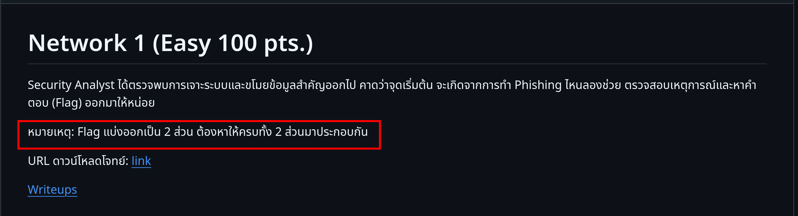

# Writeups

### Step 1

หลังจากโหลด file มาแล้วเราก็มาแตกไฟล์กัน

```bash
[simon@phy9 tmp]$ unzip junior_net1.zip
Archive:  junior_net1.zip
  inflating: junior_net1.png
  inflating: __MACOSX/._junior_net1.png
  inflating: junior_net1.pcapng
  inflating: __MACOSX/._junior_net1.pcapng
```

เปิดไฟล์ junior_net1.pcapng ด้วย wireshark หลังจากนั้นลองเข้าไปส่องใน Protocol Hierarchy ก่อน


จะเห็นว่ามีแค่ TCP เราก็กด follow tcp ดู


ลองไปกด Find next ไปเรื่อยๆ จะเห็นว่ามีอะไรน่าสนใจ


```
ZmxhZ3tqdW5pb3JfbmV0MV9kZDEwNjQK
```

จากที่เห็น string ก็เดาได้ว่าน่าจะเป็น base64 มาลอง decode กัน จะให้ [cyberchef](https://gchq.github.io/CyberChef/) ก็ได้

```bash
[simon@phy9 Network1]$ echo "ZmxhZ3tqdW5pb3JfbmV0MV9kZDEwNjQK" | base64 -d
flag{junior_net1_dd1064
```

เราก็จะได้ flag มาส่วนนึง โจทย์บอกเราว่า flag มี 2 ส่วน



ต่อไปเราก็ต้องไปหา flag อีกส่วน ลองกด follow tcp ไปเรื่อยๆ เราก็จะเจอกับอะไรบางอย่าง


```
OGVlZTJiZjJkNzE4OTMwYzliMmZiZWJhZTF9Cg==
```
ลอง decode ดู 

```bash
[simon@phy9 Network1]$ echo "OGVlZTJiZjJkNzE4OTMwYzliMmZiZWJhZTF9Cg==" | base64 -d
8eee2bf2d718930c9b2fbebae1}
```
นำ flag ทั้งสองมารวมกันก็จะได้ flag

flag : flag{junior_net1_dd10648eee2bf2d718930c9b2fbebae1}