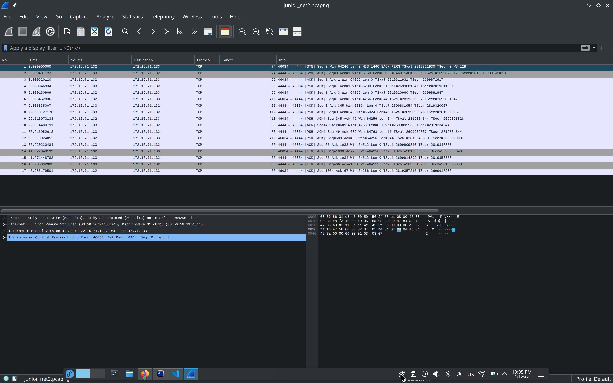
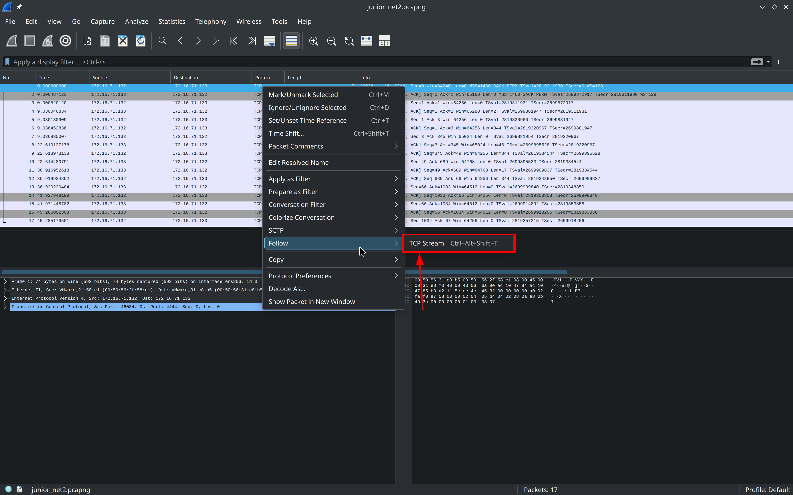
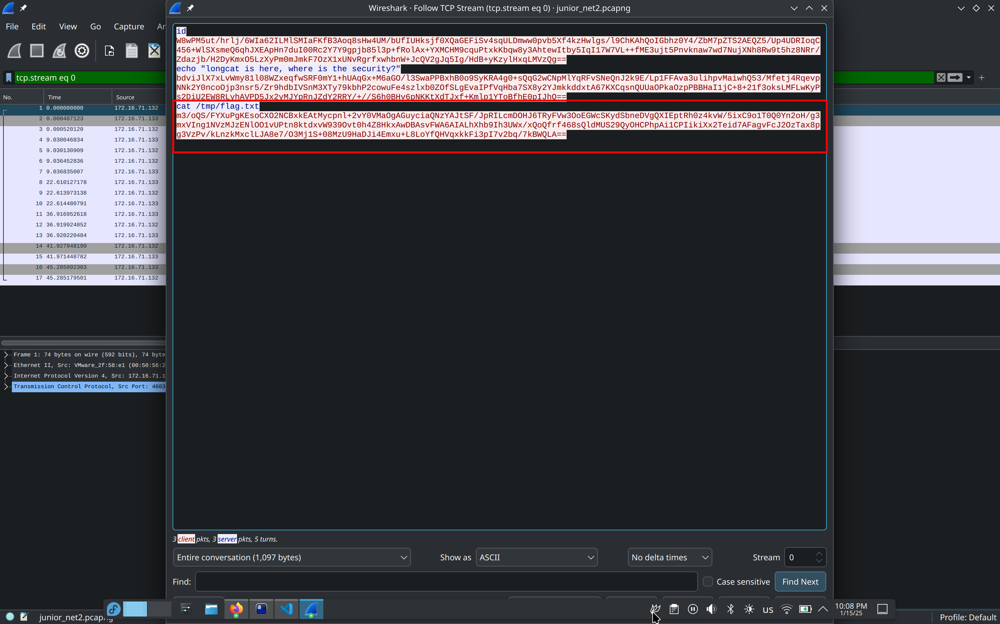
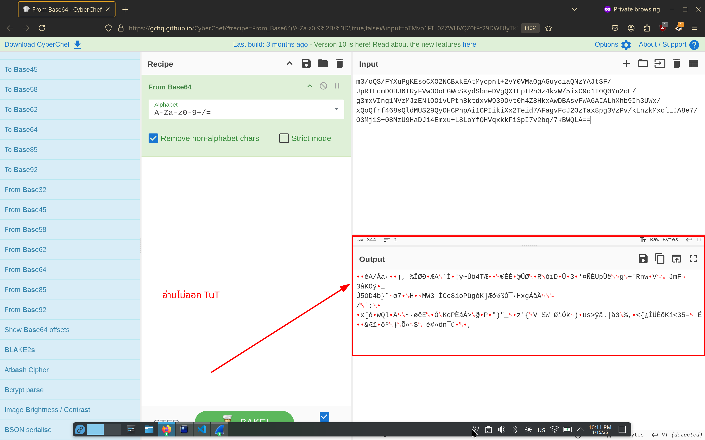
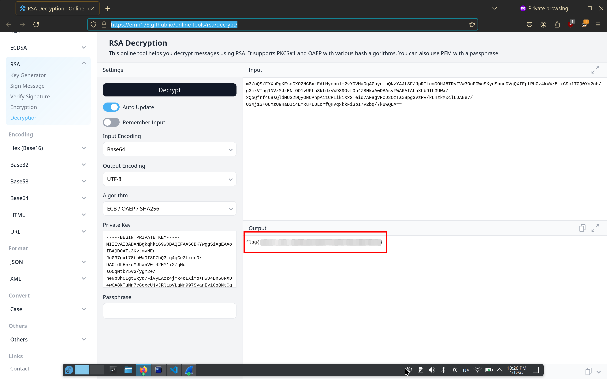

# Writeups

หลังจากโหลด file มาแล้วเราก็มาแตกไฟล์กัน

```bash
[simon@phy9 tmp]$ unzip junior_net2.zip
Archive:  junior_net2.zip
  inflating: junior_net2.pcapng
  inflating: __MACOSX/._junior_net2.pcapng
  inflating: private_key.pem
  inflating: __MACOSX/._private_key.pem
```

ลองเปิดไฟล์ junior_net2.zip



จะเห็นได้ว่ามีแค่ tcp อย่างเดียวงั้นเราลอง follow tcp stream





เห็นได้ว่า user ชื่อ longcat ได้ cat file flag.txt ออกมาแต่ออกมาเป็น format แปลกๆ จากรูปก็น่าจะเดาได้ว่าเป็น base 64 งั้นเราลองโยนเข้า (cyberchef)[https://gchq.github.io]



ลองกลับไปดูที่โจทย์ใหม่

```
คำใบ้:
- rsa_padding_mode:oaep
- rsa_oaep_md:sha256
```

จากที่ลองไป google มาตอนนี้เรามี private key แล้วกับข้อความที่เราต้องการ decrypt ได้เลย [ผมใช้เว็บนี้](https://emn178.github.io/online-tools/rsa/decrypt/)



เราก็จะได้ flag