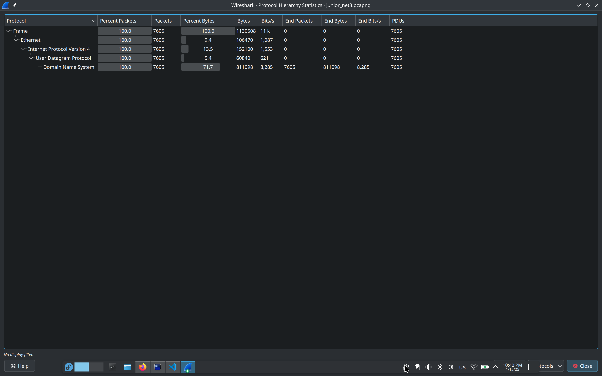
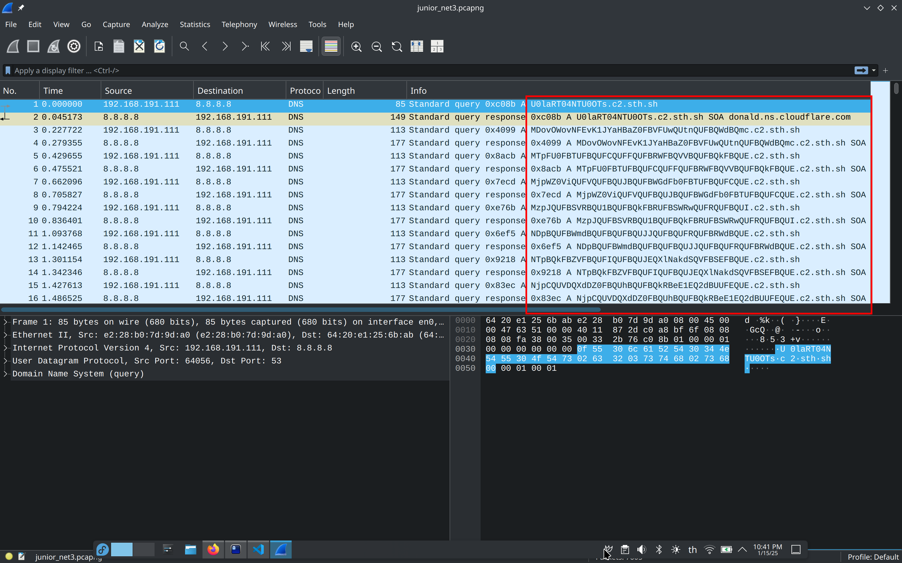
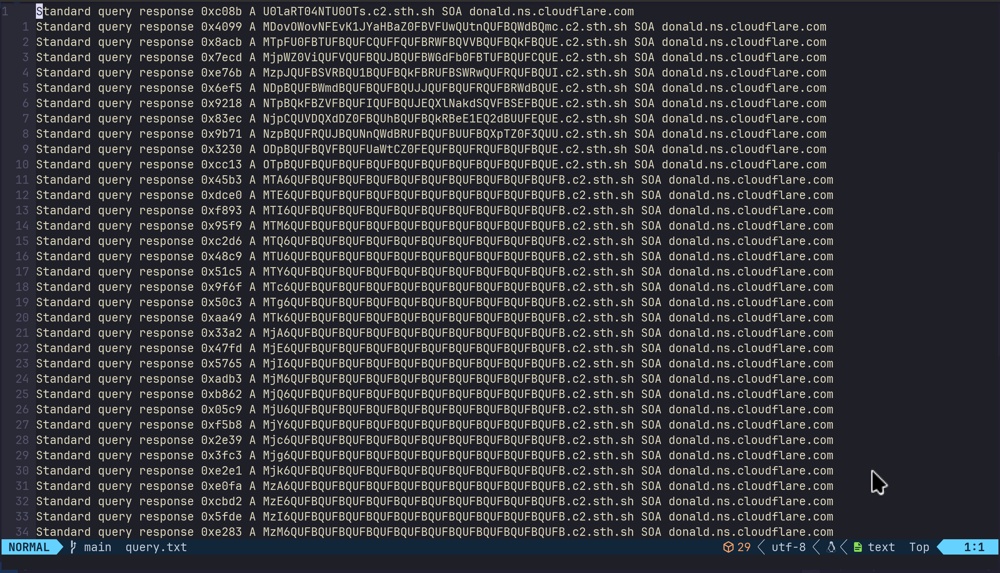
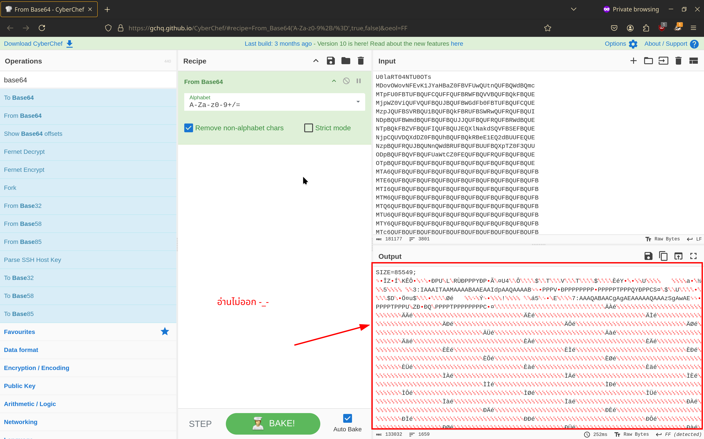
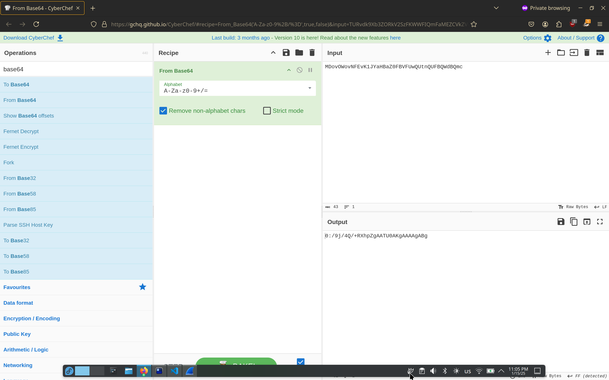
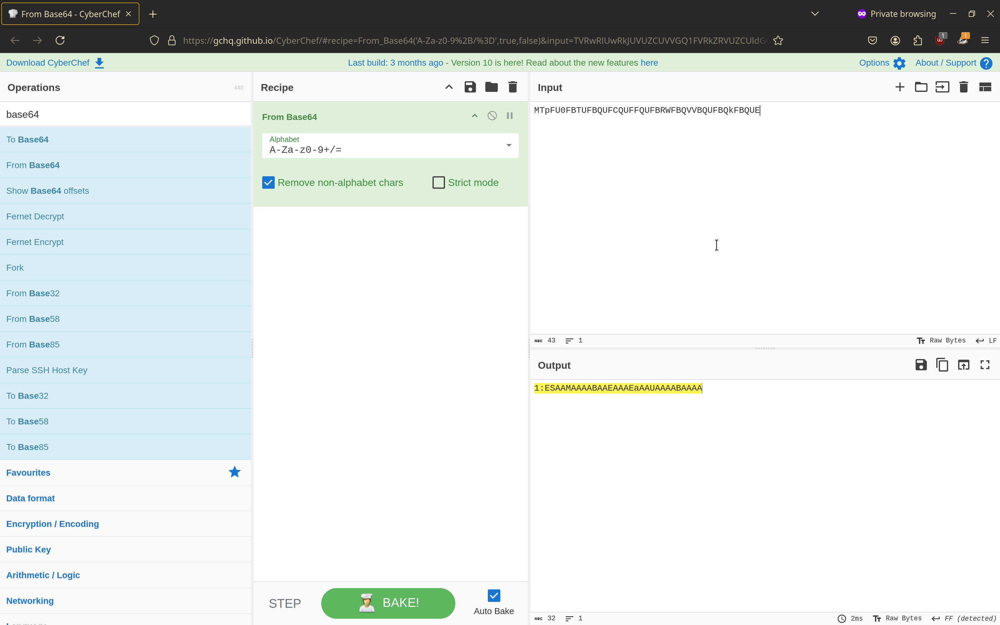
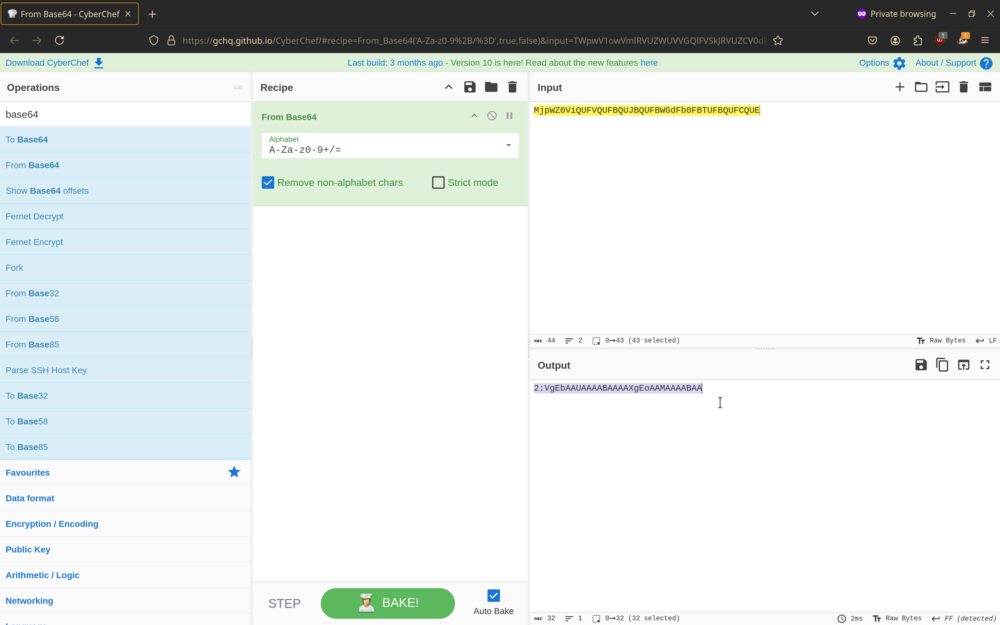
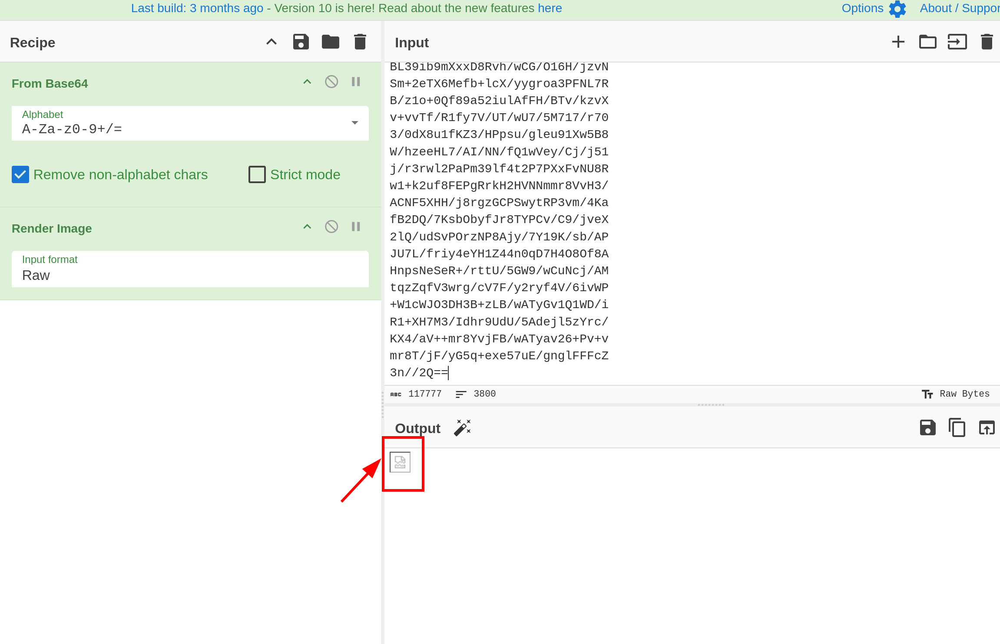
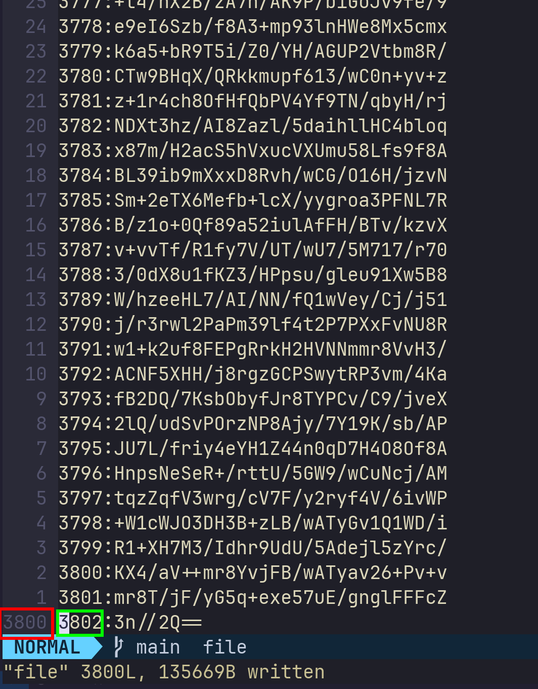
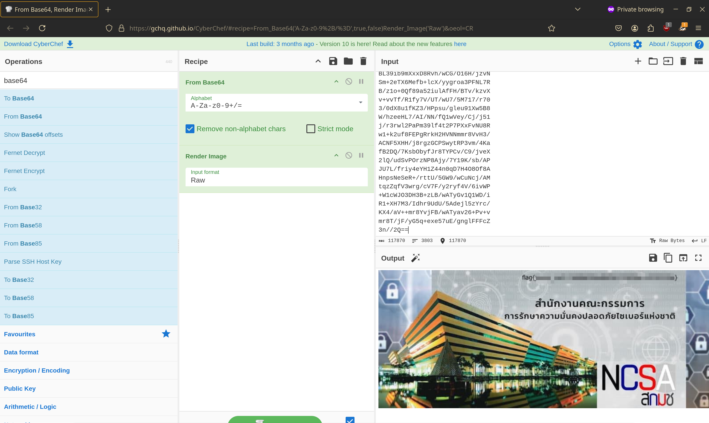

# Writeups

หลังจากโหลด file มาแล้วเราก็มาแตกไฟล์กัน

```bash
[simon@phy9 tmp]$ unzip junior_net3.zip
Archive:  junior_net3.zip
  inflating: junior_net3.pcapng
  inflating: __MACOSX/._junior_net3.pcapng
```
เปิดไฟล์ junior_net3.pcapng ด้วย wireshark หลังจากนั้นลองเข้าไปส่องใน Protocol Hierarchy ก่อน



จะเห็นได้ว่ามีแค่ DNS งั้นเรามาลองดูที่ DNS กัน



มีบางอย่างน่าสงสัยเดาว่าน่าจะเป็น base64 งั้นเราลอง copy ข้อความไป decode ดู

```
U0laRT04NTU0OTs
```

```bash
[simon@phy9 tmp]$ echo "U0laRT04NTU0OTs" | base64 -d
SIZE=85549;[simon@phy9 tmp]$
```

จะได้คำว่า "SIZE=85549" เดาว่าน่าจะเป็นคำใบ้บอกขนาดของไฟล์งานต่อไปของเราคือลองแยกข้อความจาก file นี้ดูแล้วเราจะทำได้อย่างไร มันก็ทำได้หลายท่า ผมขอใช้ tshark ในการแยกข้อความ

```bash
[simon@phy9 tmp]$ tshark -r junior_net3.pcapng -T fields -e _ws.col.Info -Y "_ws.col.info contains donald.ns.cloudflare.com" > query.txt
```
ขอแวะมาอธิบาย tshark แป๊บนึง
```
-r อ่านไฟล์
-T เลือก format ของ output เลือกได้หลายรูปแบบ เช่น json, ps, fields กรณีนี้เราจะเลือก field
-e _ws.col.Info เลือก colunm ที่จะแสดง
-Y filter 
```

ได้เวลาจัดการ text 



ผมจะให้ cut ในการจัดการกับข้อความ

```bash
[simon@phy9 tmp]$ cat query.txt | cut -d " " -f6 | cut -d "." -f1 > out.txt
```
แวะอธิบาย cut 

```
-d delimeter คือสิ่งที่เราจะใช้แบ่งระหว่างข้อความ 
-f คือ column ที่เราต้องการ
```
Ex. ( column 2 )
```
[simon@phy9 tmp]$ echo "1 2 3 4 5" | cut -d " " -f2
2
```
ลองเปิดดูใน out.txt

```bash
[simon@phy9 tmp]$ cat out.txt | head
U0laRT04NTU0OTs
MDovOWovNFEvK1JYaHBaZ0FBVFUwQUtnQUFBQWdBQmc
MTpFU0FBTUFBQUFCQUFFQUFBRWFBQVVBQUFBQkFBQUE
MjpWZ0ViQUFVQUFBQUJBQUFBWGdFb0FBTUFBQUFCQUE
MzpJQUFBSVRBQU1BQUFBQkFBRUFBSWRwQUFRQUFBQUI
NDpBQUFBWmdBQUFBQUFBQUJJQUFBQUFRQUFBRWdBQUE
NTpBQkFBZVFBQUFIQUFBQUJEQXlNakdSQVFBSEFBQUE
NjpCQUVDQXdDZ0FBQUhBQUFBQkRBeE1EQ2dBUUFEQUE
NzpBQUFRQUJBQUNnQWdBRUFBQUFBUUFBQXpTZ0F3QUU
ODpBQUFBQVFBQUFUaWtCZ0FEQUFBQUFRQUFBQUFBQUE
.
.
.
```
ลองโยนเข้า [cyberchef](https://gchq.github.io/CyberChef/)



หลังจากที่ผมลองงมมาหลาย ชั่วโมง ผมลองเอา base64 มา decode ทีละบรรทัด





จะเห็นได้ว่า decode แล้วจะได้
```
0:/9j/4Q/+RXhpZgAATU0AKgAAAAgABg
1:ESAAMAAAABAAEAAAEaAAUAAAABAAAA
2:VgEbAAUAAAABAAAAXgEoAAMAAAABAA
```
จะเห็นว่า จะเป็น เลข:base64 ได้เวลา decode อีกรอบ

```py
# python3
# main.py
import base64


def read_file(path):
    with open(path, "r") as f:
        return f.readlines()


def fix_padding(s):
    while len(s) % 4 != 0:
        s += "="
    return s


for l in read_file("./out.txt"):
    l = l.strip()
    print(base64.b64decode(fix_padding(l)).decode())
```

```bash
[simon@phy9 tmp]$ python3 main.py > file
```
```bash
[simon@phy9 tmp]$ cat file | head
SIZE=85549;
0:/9j/4Q/+RXhpZgAATU0AKgAAAAgABg
1:ESAAMAAAABAAEAAAEaAAUAAAABAAAA
2:VgEbAAUAAAABAAAAXgEoAAMAAAABAA
3:IAAAITAAMAAAABAAEAAIdpAAQAAAAB
4:AAAAZgAAAAAAAABIAAAAAQAAAEgAAA
5:ABAAeQAAAHAAAABDAyMjGRAQAHAAAA
6:BAECAwCgAAAHAAAABDAxMDCgAQADAA
7:AAAQABAACgAgAEAAAAAQAAAzSgAwAE
8:AAAAAQAAATikBgADAAAAAQAAAAAAAA
```
ต่อไปก็ตัดเลขด้านหน้าออก

```bash
[simon@phy9 tmp]$ cat file | cut -d ":" -f2 > b64
```

หลังจากนั้นเอาไฟล์โยนเข้า [cyberchef](https://gchq.github.io/CyberChef/)



Hmm.. น่าจะเป็นรูปอะไรสักอย่าง เจอเหตุการณ์แบบนี้ผมจะเดาว่าเลขเราอาจจะไม่ครบ



เลขไม่ครบเดาว่าน่าจะผิดจากขั้นตอนแยกข้อความกลับไปขั้นตอน tshark ใหม่

```bash
[simon@phy9 tmp]$ tshark -r junior_net3.pcapng -T fields -e _ws.col.Info -Y "_ws.col.info contains sth.sh" > query.txt
```
ได้เวลาเอาใหม่ผมแนะนำว่าให้ลองจัดการกับข้อความให้ดีแล้วจะได้รูปมา

